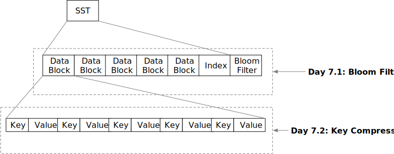

# SST Optimizations

at the end of each week, we will have some easy, not important, while interesting things

In this chapter, you will:

* Implement bloom filter on SSTs and integrate into the LSM read path `get`.
* Implement key compression in SST block format.

## Task 1: Bloom Filters

## Task 2: Integrate Bloom Filter on the Read Path

## Task 3: Key Compression Encoding + Decoding

## Test Your Understanding

* How does the bloom filter help with the SST filtering process? What kind of information can it tell you about a key? (may not exist/may exist/must exist/must not exist)
* Consider the case that we need a backward iterator. How does key compression affect backward iterators? Any way to improve it?
* Can you use bloom filters on scan?

We do not provide reference answers to the questions, and feel free to discuss about them in the Discord community.

{{#include copyright.md}}
